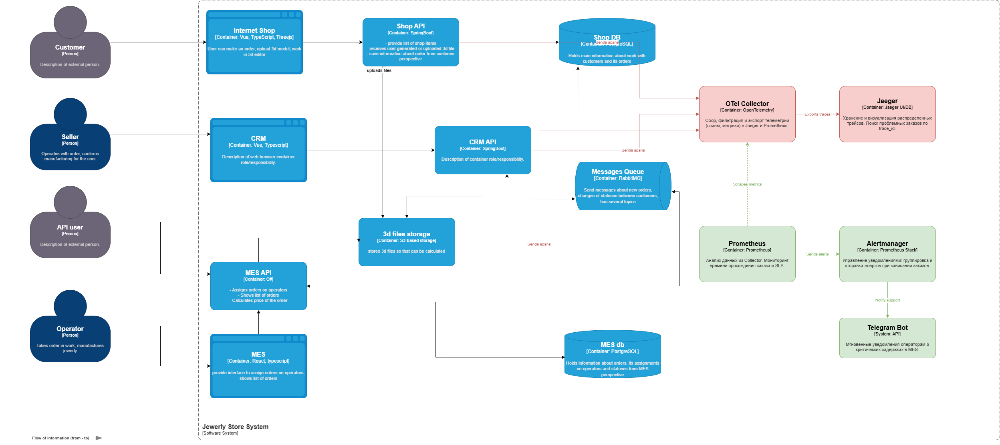

# Архитектурное решение по трейсингу в системе «Александрит»

## 1. Анализ системы и идентификация точек отказа

Для обеспечения полной наблюдаемости за жизненным циклом заказа необходимо покрыть трейсингом весь путь прохождения данных.

**Места, где заказ может «сломаться» или зависнуть:**

1.  **Shop API → RabbitMQ:** Сообщение о новом заказе (`SUBMITTED`) может не дойти до очереди из-за сбоя сети или брокера.
    
2.  **RabbitMQ → MES API:** MES может не успевать вычитывать сообщения или «падать» при попытке десериализации сложной 3D-модели.
    
3.  **MES API (Внутренние процессы):** Тяжелый процесс расчета стоимости (до 30 минут) может завершиться ошибкой без уведомления других систем.
    
4.  **MES API → RabbitMQ:** После расчета цены (`PRICE_CALCULATED`) статус может не проброситься обратно в CRM.
    
5.  **External B2B API → MES API:** Прямые вызовы от партнеров могут обрываться по таймауту, не оставляя следов в логах CRM.
    

**Системы под покрытием трейсинга:**

-   **Онлайн-магазин (Shop API):** Точка входа для B2C.
    
-   **CRM API:** Владелец статусов заказа и точка входа для менеджеров.
    
-   **MES API:** Центр обработки тяжелых задач и производства.
    
-   **RabbitMQ:** Промежуточный слой (необходимо логирование прохождения сообщений через заголовки).
    

----------

## 2. Список данных для трейсинга (Attributes/Tags)

Для эффективного поиска по трейсам в Jaeger необходимо передавать следующие атрибуты:

-   `order_id`: Уникальный ID заказа (основной ключ для поиска).
    
-   `customer_id`: Тип клиента (B2B или B2C).
    
-   `order_status`: Текущий статус заказа (INITIATED, SUBMITTED и т.д.).
    
-   `file_size_polygons`: Количество полигонов в модели (для корреляции с задержками в MES).
    
-   `error.message`: Текст ошибки при сбое.
    
-   `messaging.system`: Идентификатор RabbitMQ для отслеживания пути через очередь.
    

----------

## 3. Мотивация

Внедрение распределенной трассировки необходимо для перехода от «интуитивной» отладки к доказательной. Сейчас компания теряет B2B контракты, потому что не может объяснить, где именно пропадают заказы.

**Влияние на метрики:**

1.  **MTTR (Mean Time To Repair):** Сокращение времени на поиск причины сбоя с нескольких дней до минут.
    
2.  **Order Success Rate (бизнес-метрика):** Процент заказов, успешно дошедших до статуса SHIPPED.
    
3.  **Lead Time (бизнес-метрика):** Среднее время от нажатия кнопки «Заказать» до готовности изделия.
    
4.  **Request Latency (P99):** Точное измерение времени обработки 3D-моделей в MES.
    

----------

## 4. Предлагаемое решение

**Технологический стек:**

-   **OpenTelemetry SDK (OTel):** Инструментация кода на Java (Spring Boot) и C#.
    
-   **OpenTelemetry Collector:** Промежуточный агент для сбора, обработки и экспорта данных.
    
-   **Jaeger:** Хранилище и UI для визуализации трейсов.
    
-   **W3C Trace Context:** Стандарт проброса заголовков (`traceparent`) через HTTP и RabbitMQ.
    

**Изменения в архитектуре:**

1.  В **Shop, CRM и MES** внедряются SDK OpenTelemetry.
    
2.  При публикации сообщения в RabbitMQ в `BasicProperties.Headers` записывается текущий `trace_id`.
    
3.  При получении сообщения MES API извлекает контекст и продолжает трейс.
    

**Схема архитектуры (описание изменений):**

-   _Новые компоненты (КРАСНЫМ на C4):_ **OTel Collector**, **Jaeger UI**, **Jaeger DB**.
    
-   _Новые связи (КРАСНЫМ на C4):_ Потоки данных от всех API к OTel Collector (gRPC/HTTP).
    
----------

## 5. Компромиссы и Безопасность

**Компромиссы:**

-   **Стоимость хранения:** Трейсы генерируют огромный объем данных. Решение: использование Sampling (например, записывать только 10% успешных запросов и 100% запросов с ошибками).
    
-   **Производительность:** Инструментация вносит небольшую задержку (overhead). Для MES с его 30-минутными задачами это некритично, но для Shop API нужно мониторить.
    

**Безопасность:**

-   **Доступ:** Jaeger UI должен быть закрыт внутри корпоративной сети (VPN) и требовать авторизацию через корпоративный LDAP/Active Directory.
    
-   **Маскирование данных:** В атрибуты трейсов запрещено передавать PII (персональные данные клиентов: имена, телефоны). Только ID.
    
-   **Защита экспорта:** Передача данных от сервисов к коллектору должна идти по зашифрованному каналу (TLS).
    

----------

## 6. Автоматический мониторинг и алертинг (Дополнительное задание)

Для автоматизации контроля процесса мы внедрим компонент **Alerting Service**, который будет анализировать данные из хранилища трейсов.

**Логика работы:**

1.  **Prometheus** через `span-metrics-processor` в OTel Collector собирает статистику по длительности спанов.
    
2.  Если спан со статусом `MANUFACTURING_STARTED` длится более 72 часов без перехода в следующий статус, срабатывает алерт.
    
3.  **Алертинг:** Уведомление в Telegram-бот операторов и менеджеров CRM.
    

**Изменения в архитектуре (Дополнительно):**

-   _Новые компоненты (ЗЕЛЕНЫМ на C4):_ **Prometheus**, **Alertmanager**.
    
-   _Новые связи (ЗЕЛЕНЫМ на C4):_ Связь Jaeger -> Prometheus (или Collector -> Prometheus) и Alertmanager -> Telegram.
    

----------

[Открыть исходный файл диаграммы](Task3_Tracing_Alerting_Green.drawio)