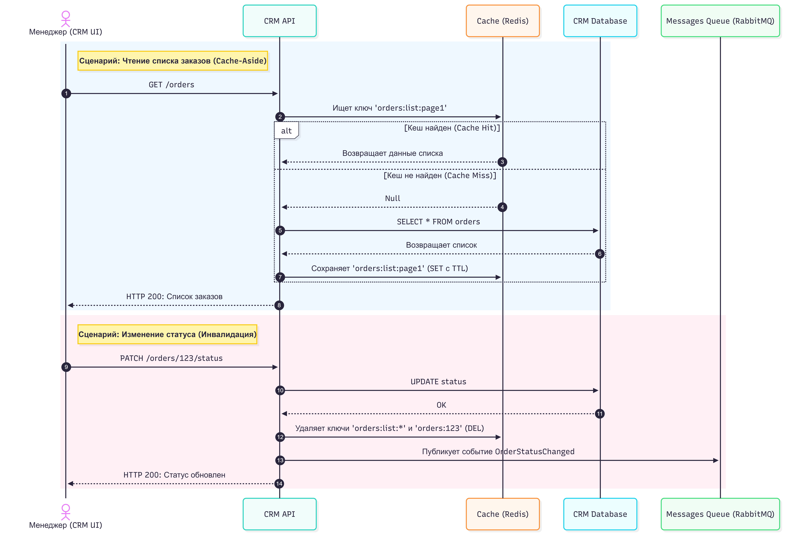

# Архитектурное решение по кешированию

## 1. Мотивация

В текущей архитектуре системы (Shop, CRM, MES) присутствует множество операций чтения. Менеджеры в CRM и операторы в MES регулярно запрашивают списки заказов и их статусы.

**Проблемы, которые решает кеширование:**

-   **Высокая нагрузка на базы данных:** При каждом обновлении страницы менеджером или оператором идет прямой запрос в `CRM DB` или `MES DB`. При росте числа заказов это приведет к деградации производительности БД.
    
-   **Задержки (Latency):** Расчет стоимости заказа и сборка полных данных о нем могут требовать времени. Кеширование готовых ответов ускорит загрузку интерфейсов CRM и MES.
    

**Что планируется кешировать:**

-   Списки заказов (с пагинацией и базовыми фильтрами) для CRM API и MES API.
    
-   Карточку конкретного заказа (детали, статус, привязанный оператор).
    

## 2. Предлагаемое решение

### Клиентское или серверное кеширование?

Предлагается использовать **Серверное кеширование (например, Redis)**.

-   _Почему не клиентское (в браузере):_ Статусы заказов постоянно меняются разными акторами (менеджер подтвердил, оператор взял в работу, Shop API обновил статус оплаты). Если использовать клиентский кеш, оператор может долго видеть неактуальный статус заказа. Серверный кеш гарантирует консистентность данных для всех пользователей.
    

### Паттерн кеширования: Cache-Aside (Ленивая загрузка)

Я предлагаю использовать паттерн **Cache-Aside**.

-   **Как работает:** Приложение сначала ищет данные в кеше. Если их нет (Cache Miss), оно идет в БД, забирает данные, кладет их в кеш и отдает пользователю.
    
-   **Почему этот паттерн:** Наша система имеет профиль нагрузки с преобладанием чтения над записью (Read-Heavy). Списки заказов запрашиваются часто, а обновляются реже. Cache-Aside идеально подходит для таких сценариев и защищает от ситуации, когда кеш забивается данными, которые никто не читает.
    
-   **Почему не Write-Through:** Замедлит операции записи (создание заказа или смену статуса), так как приложению придется синхронно писать и в БД, и в кеш. Учитывая, что мы используем асинхронное взаимодействие через `Messages Queue` (RabbitMQ), синхронная запись в кеш нарушит паттерн.
    
-   **Почему не Refresh-Ahead:** Предсказывать, какой именно фильтр или страницу списка заказов запросит менеджер, практически невозможно. Этот паттерн здесь будет тратить ресурсы впустую.
    

### Диаграмма последовательности (Sequence Diagram)

Ниже представлена логика работы Cache-Aside при чтении списка заказов и инвалидации при изменении статуса.

[Открыть исходный файл диаграммы (.mmd)](diagram.mmd)

### Стратегия инвалидации кеша

Предлагается комбинированная стратегия: **Программная инвалидация (по ключу) + Временная (TTL как фолбэк)**.

-   **Программная инвалидация (Event-based/Key-based):** Как только статус заказа меняется в CRM или MES, API отправляет команду на удаление (`DEL`) связанных ключей в Redis (например, сбрасывает кеш списков `orders:list:*` и кеш самого заказа `orders:{id}`).
    
-   **Временная (TTL):** Каждой записи в кеше задается время жизни (например, 5 минут). Это защита от багов: если программная инвалидация не сработала из-за ошибки сети, данные обновятся сами через 5 минут.
    

**Сравнительный анализ стратегий инвалидации:**

| Стратегия                      | Временная (TTL)                | Программная (Event-based / Key) |
|--------------------------------|--------------------------------|---------------------------------|
| Описание                       | Данные удаляются по таймеру    | Данные удаляются кодом при записи|
| Лучше подходит, потому что...  | Самая простая в реализации     | Гарантирует актуальность данных |
| Есть особенности               | Пользователь может видеть      | Требует аккуратного управления  |
|                                | устаревшие (stale) данные      | ключами (тегирование ключей)    |
| Позволяет сделать              | Защиту от переполнения памяти  | Мгновенное обновление интерфейса|
| Не позволяет сделать           | Получить риал-тайм консистент- | Избежать написания доп. логики  |
|                                | ность (Stale Reads)            | в сервисах                      |

----------

## 3. Дополнительное задание: Сравнительный анализ решений

При проектировании рассматривались два основных подхода к работе с кешем для нашей системы.

| Характеристика                 | Решение 1: Cache-Aside (Выбрано)                  | Решение 2: Write-Through                          |
|--------------------------------|---------------------------------------------------|---------------------------------------------------|
| Описание решения               | Сервис читает из кеша; если пусто — идет в БД,    | Сервис всегда синхронно пишет данные и в БД, и    |
|                                | кладет в кеш. При записи — удаляет кеш.           | в кеш. Чтение всегда идет только из кеша.         |
| Плюсы решения                  | - В кеше лежат только те данные, которые          | - Данные в кеше всегда на 100% актуальны.         |
|                                |   реально запрашиваются (экономия памяти).        | - Нет задержки (Cache Miss) при первом чтении.    |
|                                | - Проще логика записи.                            |                                                   |
| Минусы решения                 | - Первый запрос (Cache Miss) всегда медленный.    | - Увеличивается время ответа при записи (заказов).|
|                                | - Риск "Stale Data" при ошибках инвалидации.      | - Кеш забивается данными, которые могут ни разу   |
|                                |                                                   |   не прочитать (например, старые заказы).         |

### Заключение

Наиболее оптимальным решением для юзкейса CRM и MES API является **Решение 1 (Cache-Aside + Программная инвалидация)**.

В системах электронной коммерции и производства списки заказов просматриваются значительно чаще, чем редактируются. Cache-Aside позволяет эффективно утилизировать ресурсы памяти Redis, так как кешируются только "горячие" (активно просматриваемые) списки и заказы. Write-Through неоправданно увеличил бы сложность и время записи (создания заказа из Shop API), а также привел бы к кешированию тысяч заказов, которые лежат в архиве и которые никто не просматривает.